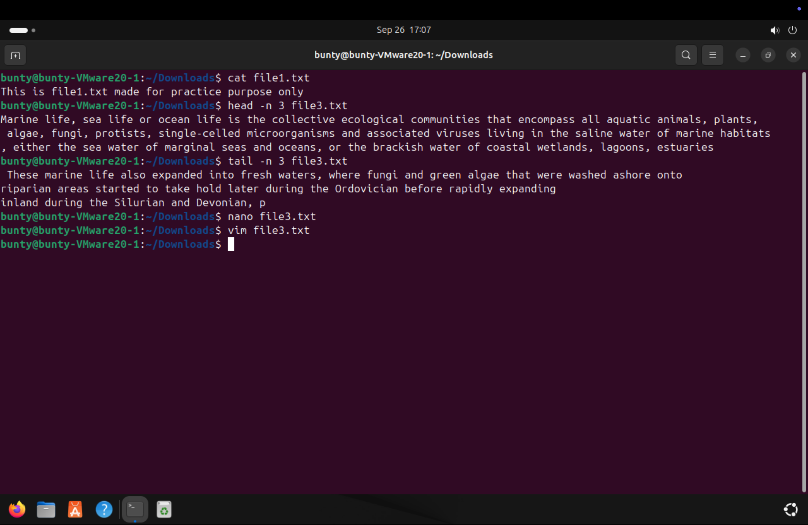
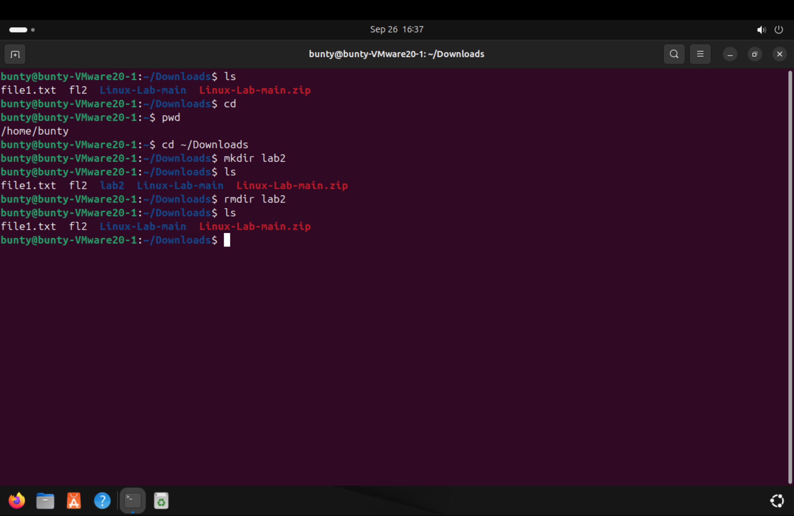
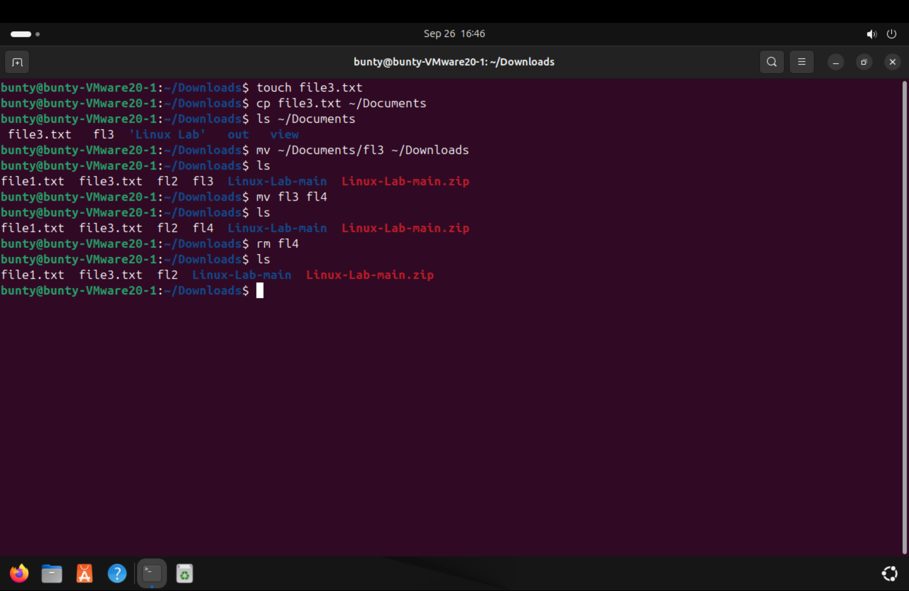
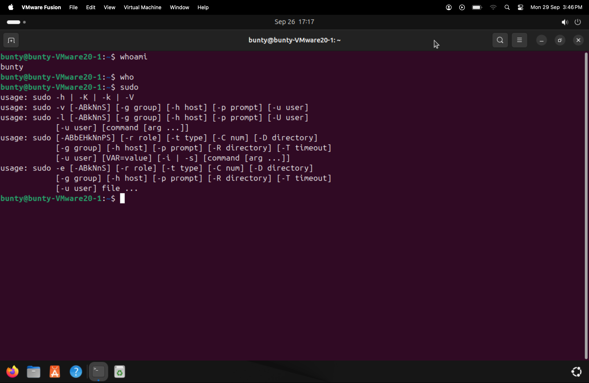
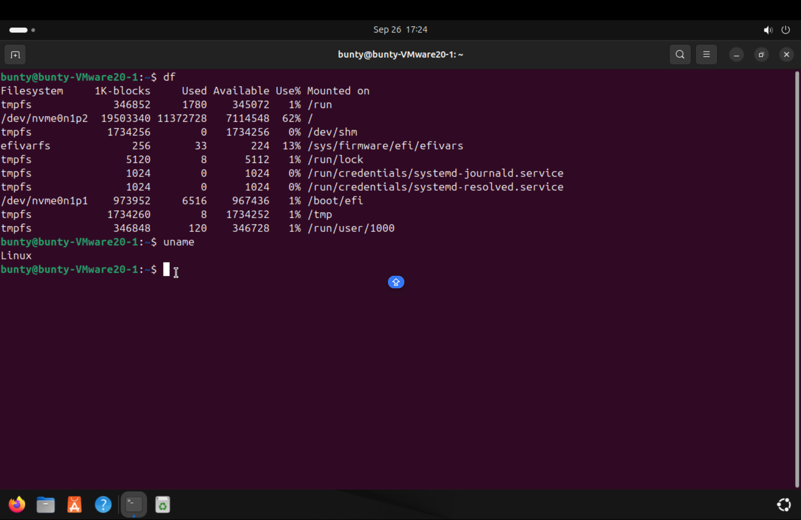
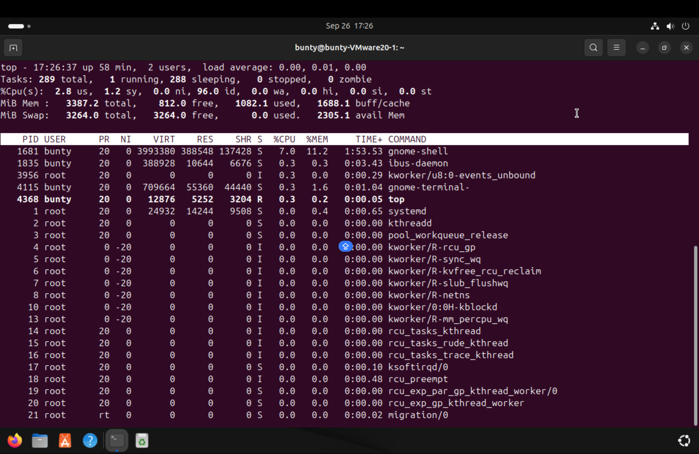
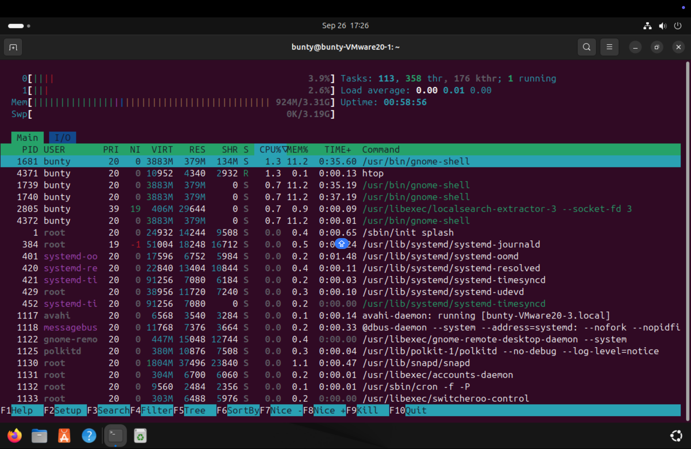
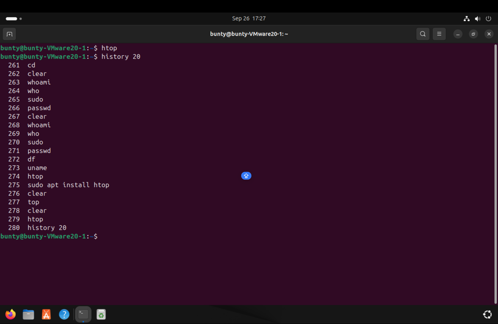

## Basic Commands in Linux
### Basic Navigation Commands

1. ` cat ` - Display the contents.
2. ` head and tail ` - Show the beginning or end of a file .
3. ` nano or vim ` - Basic text editiors.
## Baic Commands in Linux 
### Basic Navigation Commands

1. `  ls  ` - Display the contents of a directory.
2. ` cd ` - Move betwwen directories.
3. ` pwd ` - Show the current directory.
4. ` mkdir ` - Create new directory.
5. ` rmdir ` - Remove empty directory.

----------------------------------------------------------------------

### File Operation  

1. ` touch ` - create a new file.
2. `  cp ` -  Copy files and directories.
3. ` mv ` - Move or rename  files and directories.
4. ` rm ` - Delete files and directories.

----------------------------------------------------------------------

### File Viewing and Editing 
------------------------------------------------------------------

### User Management 

1. ` whoami ` - Display the current user.
2. ` passwd ` - Change the password for the current user.
3. ` sudo ` - Execute commands with administrative privileges.
4. ` who ` - Show users currently.

------------------------------------------------------------------
 ### System information 

 1. ` uname ` - Display system  information.
 2.  ` df ( disk free) ` - Show disk space usage.
 3. ` top or htop ` - Monitor system process.
 4. ` history ` - Show history.
 
 
 
 
 
 --------------------

 
 

