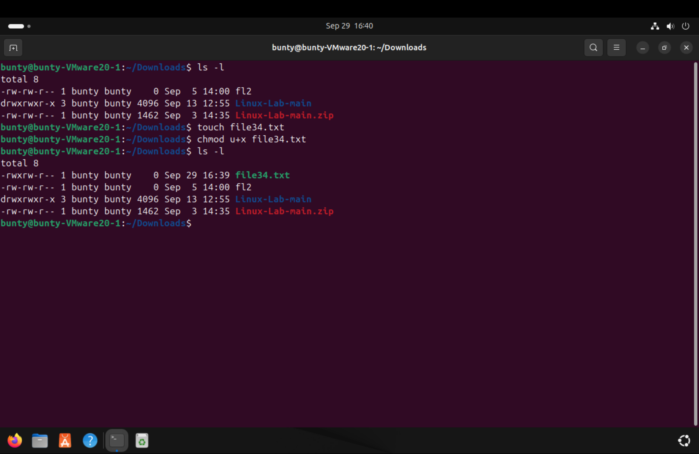

# EXPERIMENT 3
## File and Directories Command
### Working with files

1. ` touch ` - Create an empty file .
2. ` cp ` - Copy file and directories .
3. ` mv ` - Move or rename files and directories .
4. ` rm ` - Remove files and directories .
5. ` cat ` - Concatenate and display the contents of a file .
6. ` head ` - Display the first few lines of a file .
7. ` tail ` - Display the last few lines of a file .

----------

### File Permission and Ownership 
1. `  ls  -l  ` - 
2. ` chmod u+x ` - for modifying the file permission and giving accesses of executing the file to the owner.

-----------

### Advanced File and Directory Operations 

1. ` find ` - Search for files and directories based on various criteria .
2. ` grep ` - Search for specific patterns within files .
3. ` tar ` - Archive file and directories into a single file . 
4. `  gzip/gunzip  ` - Compresss or decompress the file. 
5. ` ln ` - Create hard and symbolic links .

--------------

