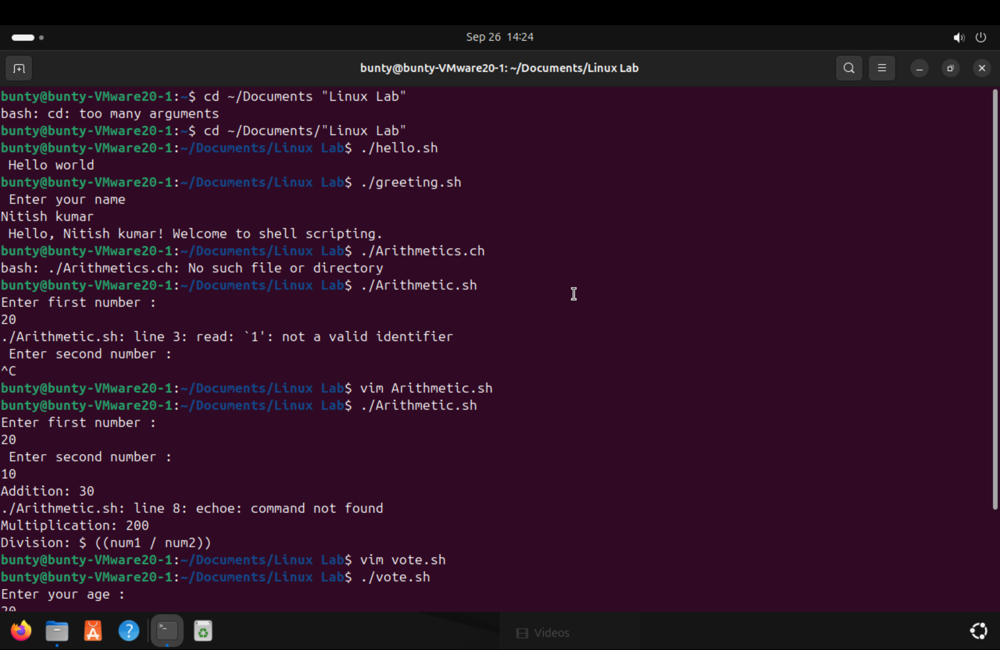
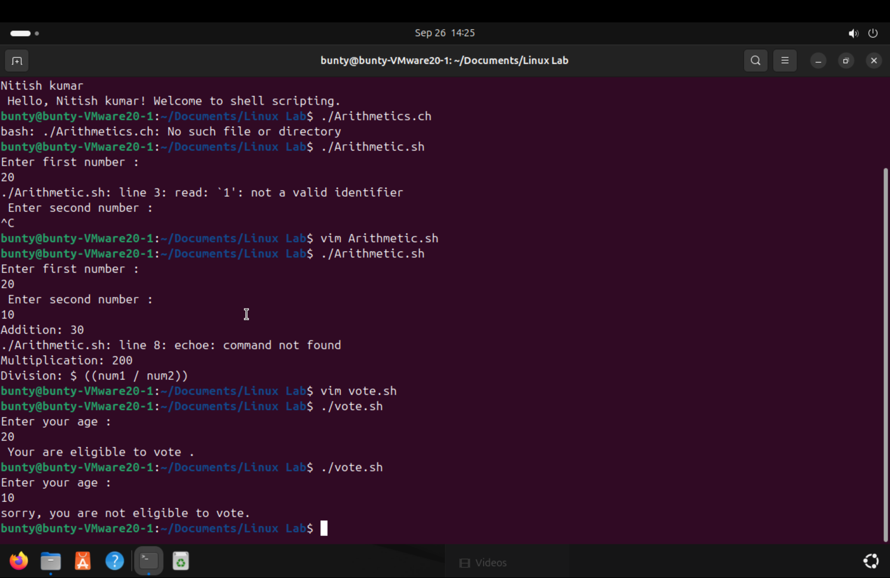

# EXPERIMENT 4 SHELL PROGRAMING
## TASKS
1. **Write a simple shell script that prints "Hello World" when execuated.**

2. **Create the script that prompts the user to enter their name and then displays a personalized greeting.**

3. **Write a script that takes two numbers as inputs and performs various arithmetic operations like addition, subtraction, multiplication and division.**

4. **Create a script that asks the user to enter their age and displays the message based on whether they are eligigble to vote or not.**

## Outputs

  

  

----------------------------------------