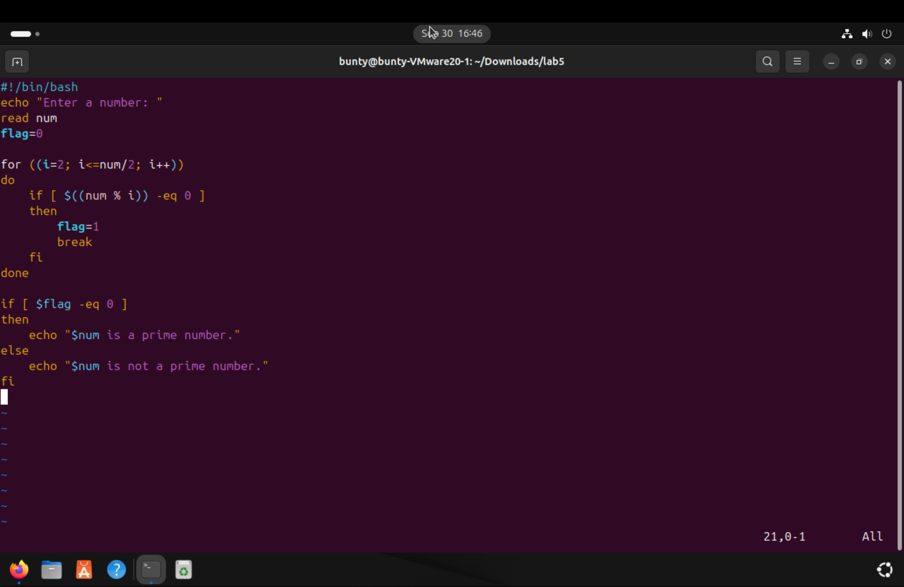
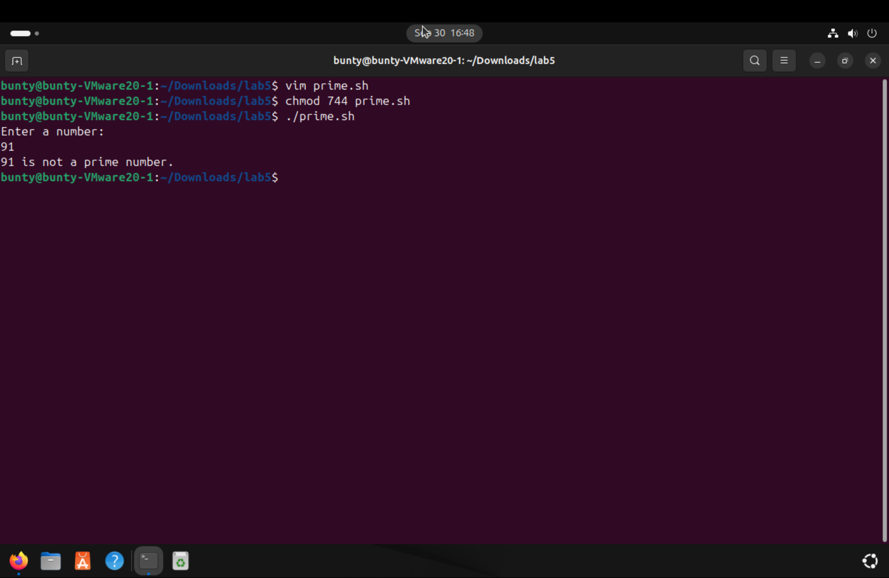
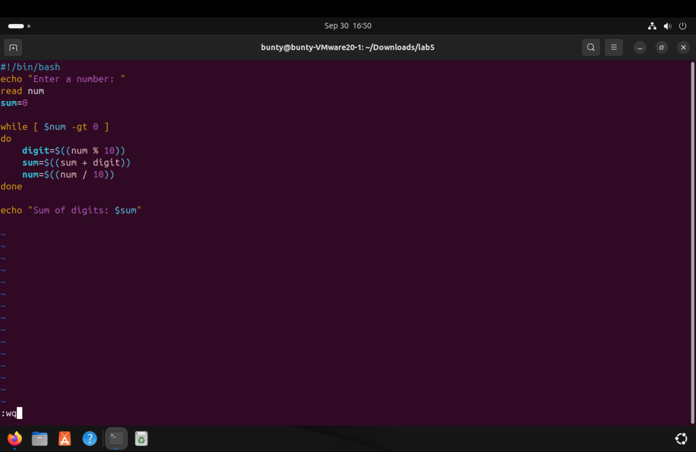
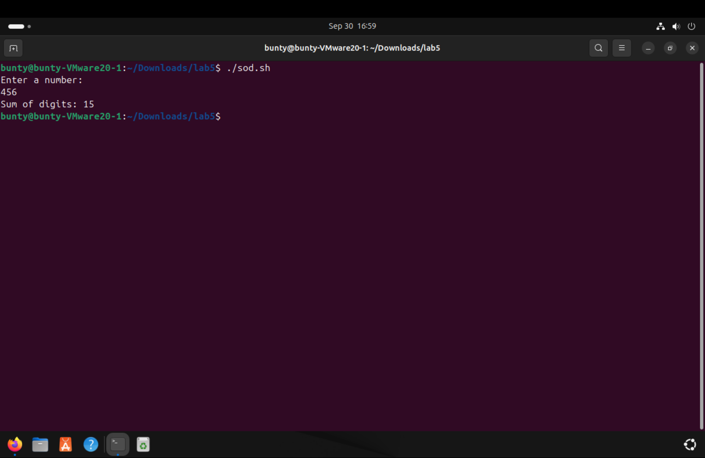
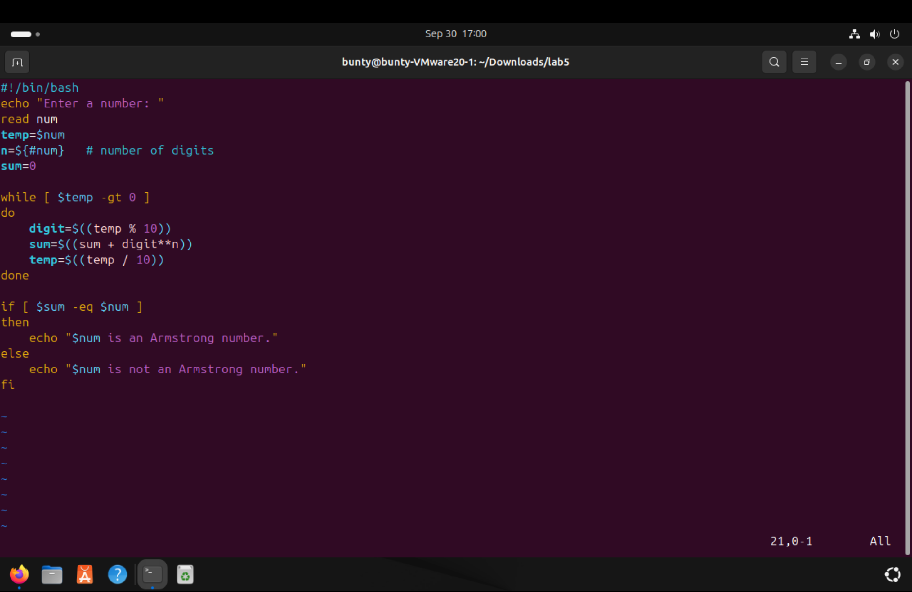
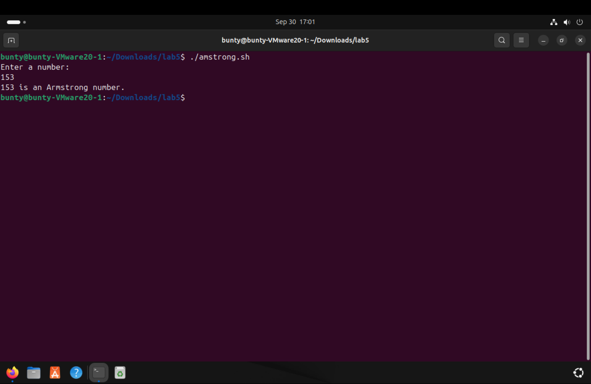

# EXPERIMENT 5
## Shell Programing
### Tasks
1. Write a script that takes a number  as input and checks whether it is prime number or not .
  
  

2. Write a script that calculates the sum of the digits of a given number .
  
  

3. Create a script that checks whether a given number is an Armstrong number or not .

  
  
