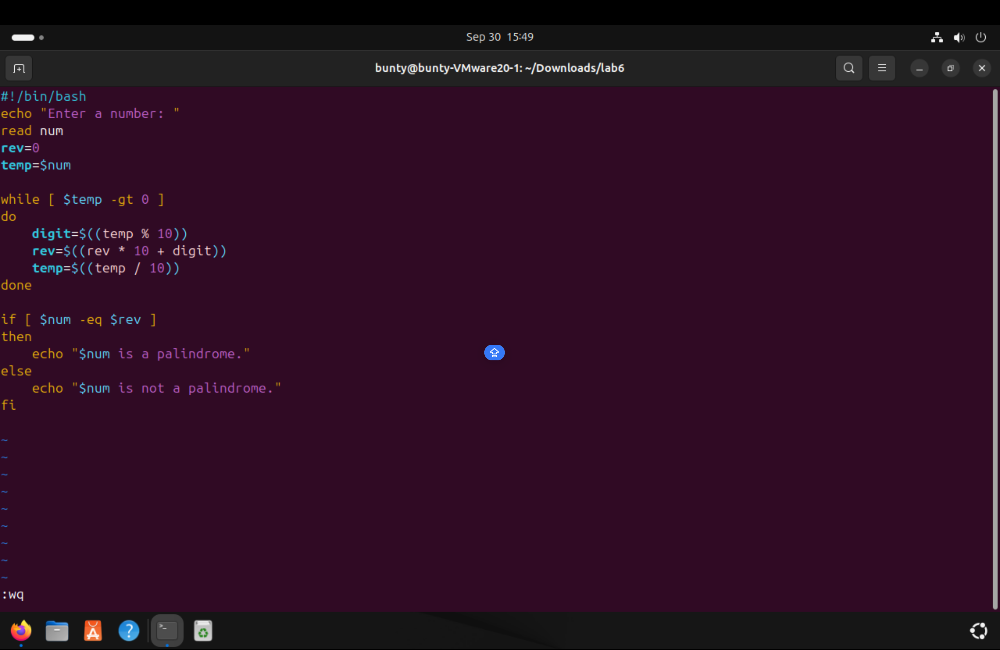
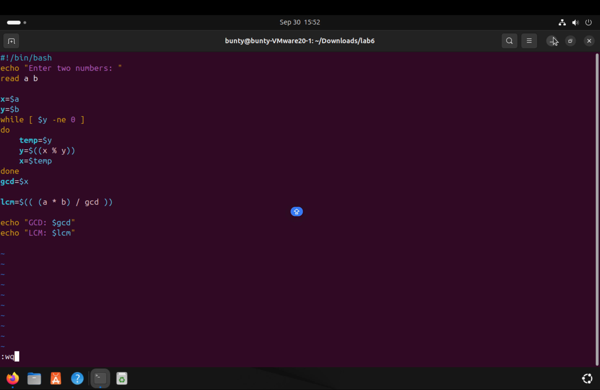
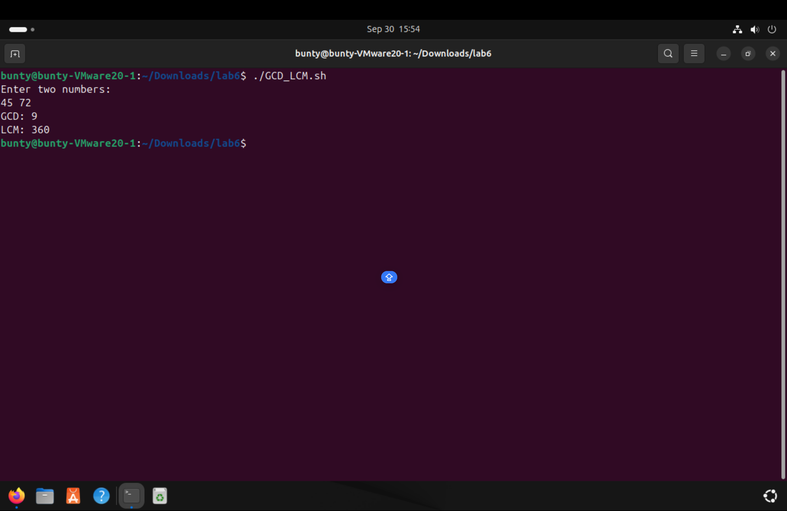
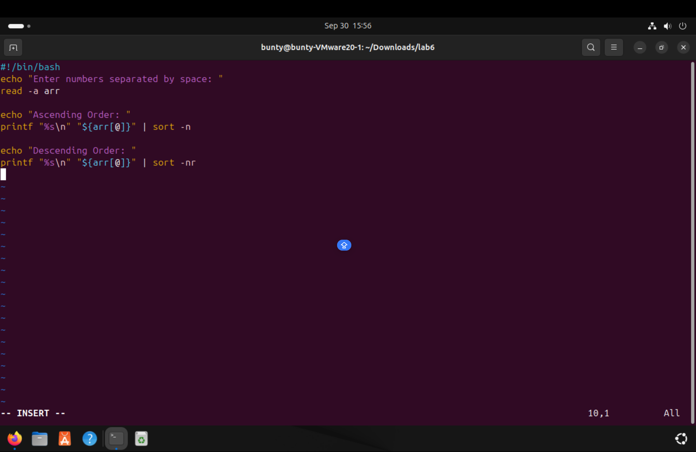
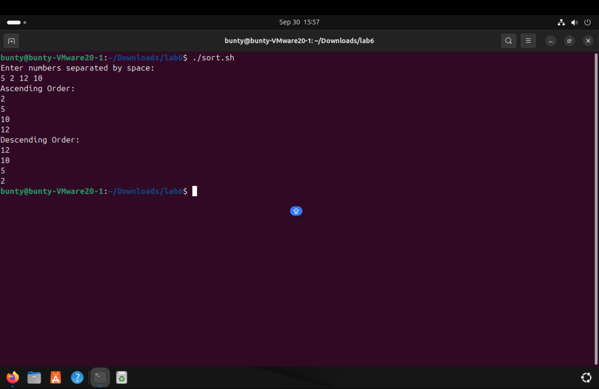

# EXPERIMENT 6
## Shell Programing
### TASKS 

1. Write a script that checks whether a given number is a palindrome or not . A palindrome number reads the same backward as forward.
   
   

2. Write a script that calculates the greatest common divisior (GCD) and the least common multiple (LCM) of two given numbers.
  
  

3. Create a script that takes multiple numbersas input and sorts them in ascending or desecnding order .
  
  