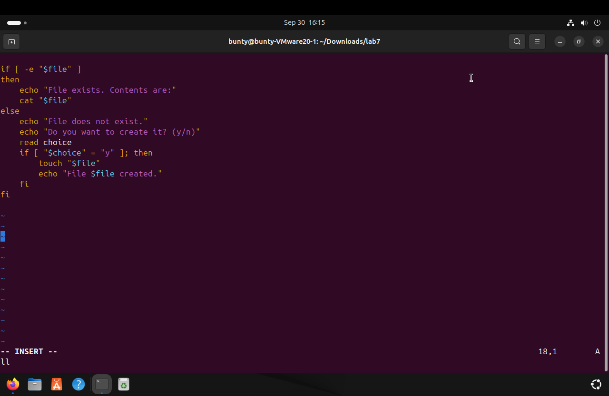
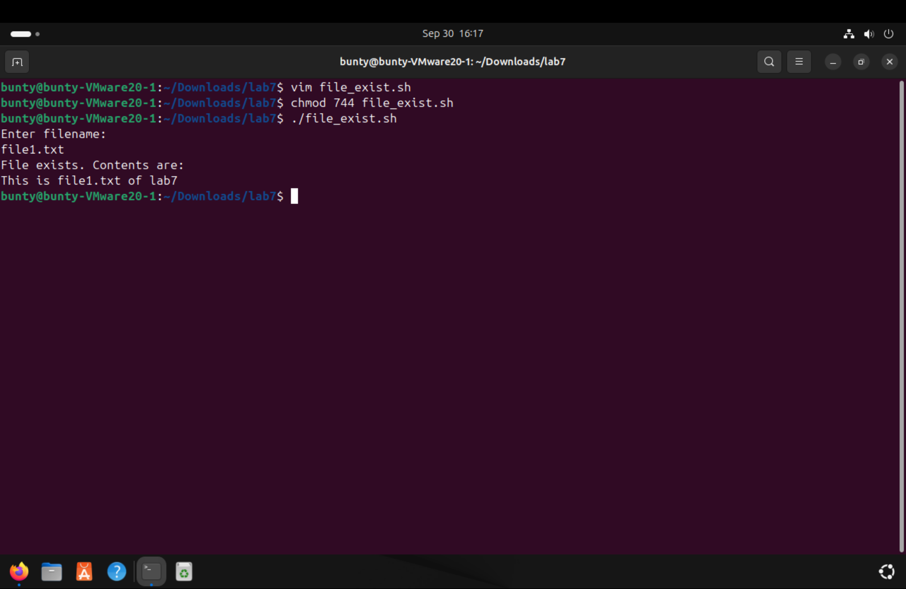
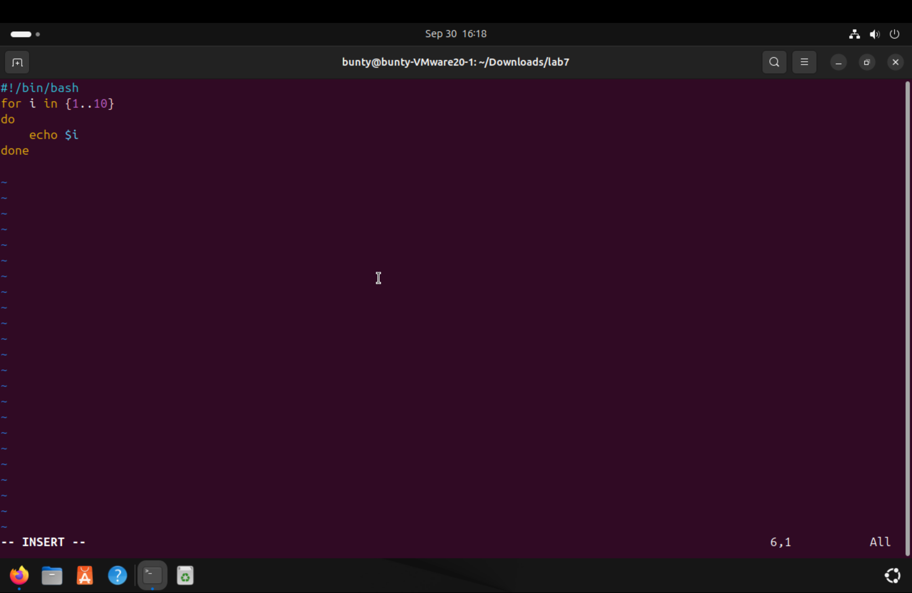
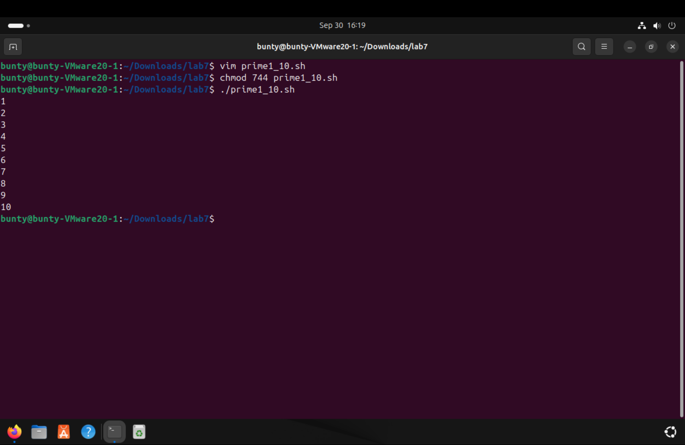
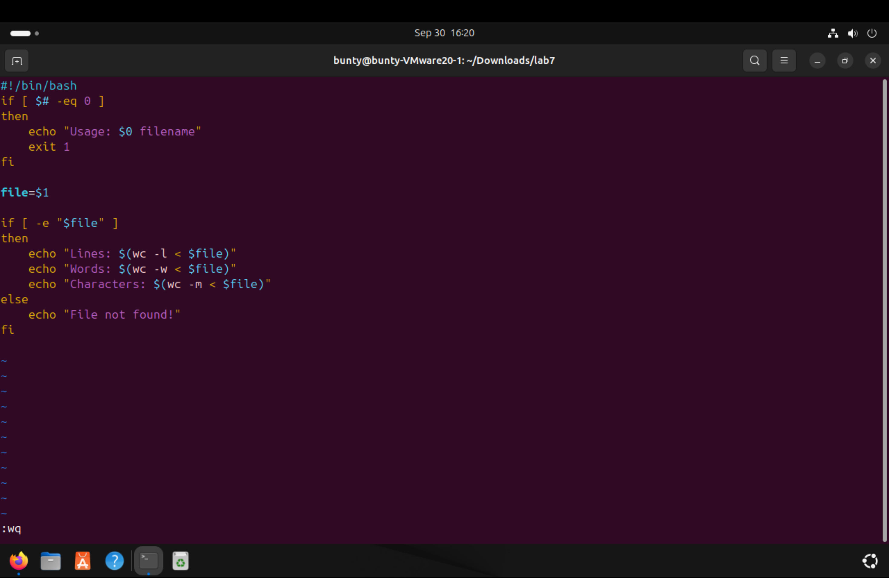
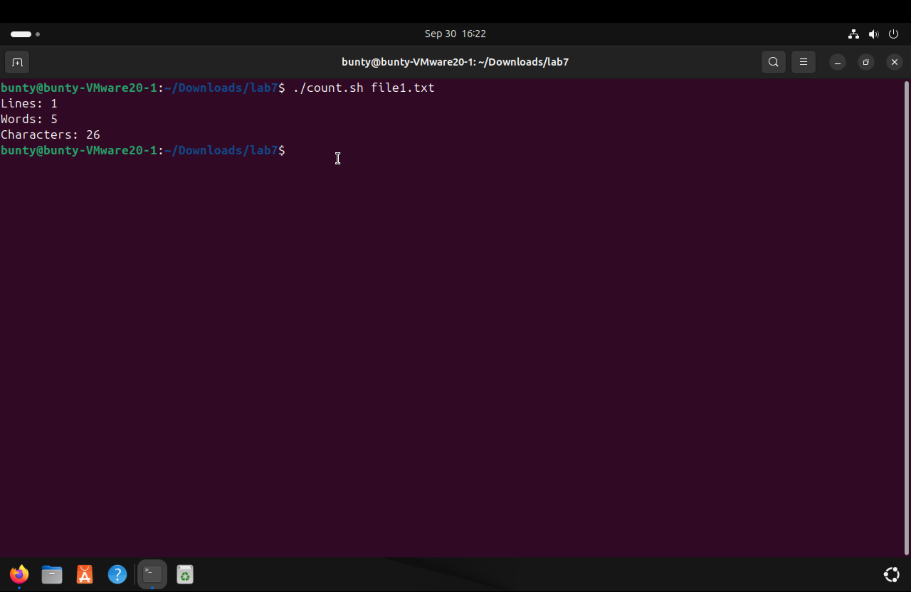
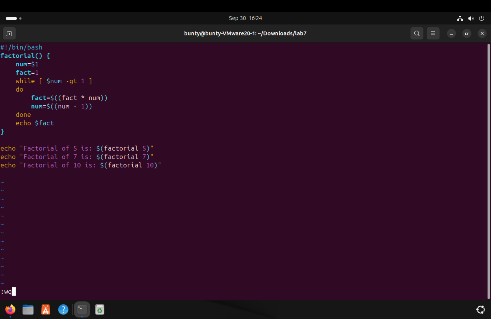
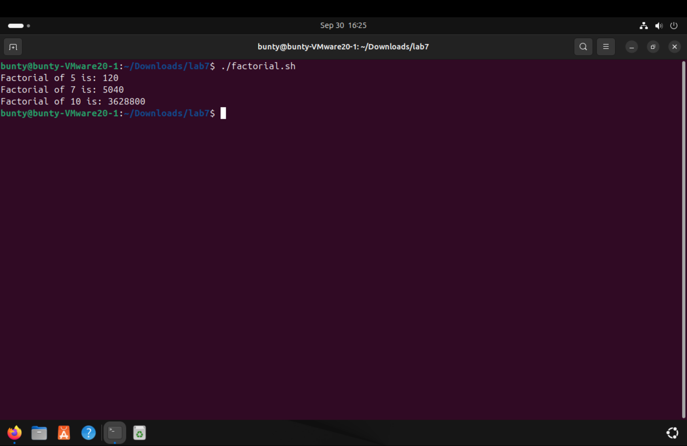

# EXPERIMENT 7
## Shell Programing
### TASKS

1. Write a script that takes a filename as input and checks if it exists. If the file exists, display its content; otherwise, prompt the user to create the file.
  
  

2. Create a script that prints the number from 1 to 10 using the loop .
  
  

3. Write a script that takes  a filename as a command line argument and counts the number of lines , words and characters in that file.
  
  

4. Create a script that defines a function to calculate the factorial of a given number and call that function with different inputs.  
  
  