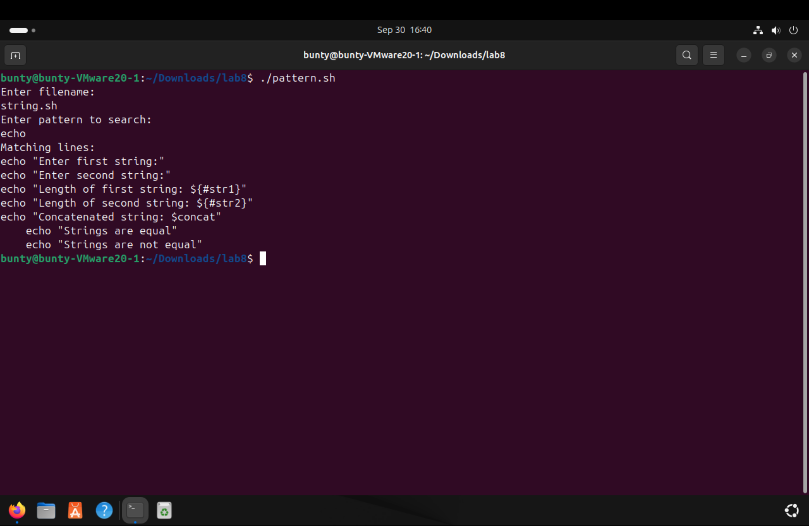

# EXPERIMENT 8
## Shell Programing
### TASKS

1. Write a script that checks the file permission of a given file and displays whether it is readable , writable , or executable by the current user.
  
  

2. Create a script that prompts the user to enter a string and then performs operations like string length , string concatentation, and string comparison.
  
  

3. Write a script that searches for a specific pattern in a given file and displays the matching lines.
  
  

4. Create a script that displays various system information like the current date and time, logged - in users, system uptime etc.
  
  